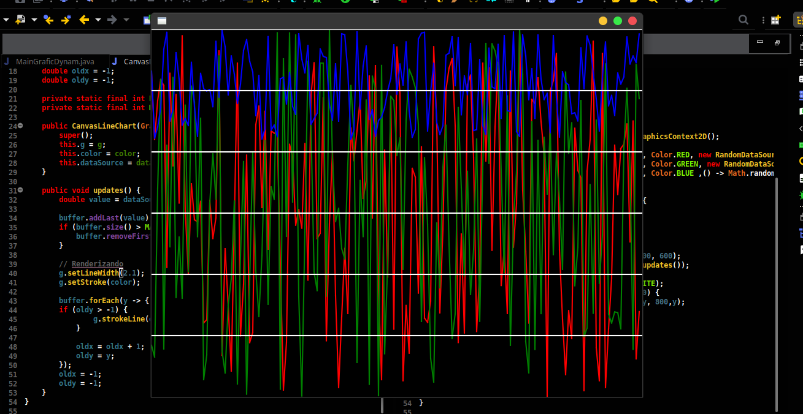

<p align="center"></p>

<h1 align="center">Dynamic random experimental chart</h1>

<h3 align="center"> Este e um gráfico de linha com dados experimentais e randômicos, apenas para exemplificar como e feito a tacha de atualização</h3>

<p align="center">
  <a href="https://github.com/Mario23junior/Dynamic-random-experimental-chart/actions/workflows/maven.yml
"></a>
<a href="https://en.wikipedia.org/wiki/Representational_state_transfer"></a>
</p>


## Etapas para testar ou reproduzir

Primeiro lembre-se de estar com o java 8 ou superior 

Em seguida execute o JAR normalmente 
 
```
java -jar GraficDynamics.jar
```

## Logo ira ver o lindo planeta vermelho.
